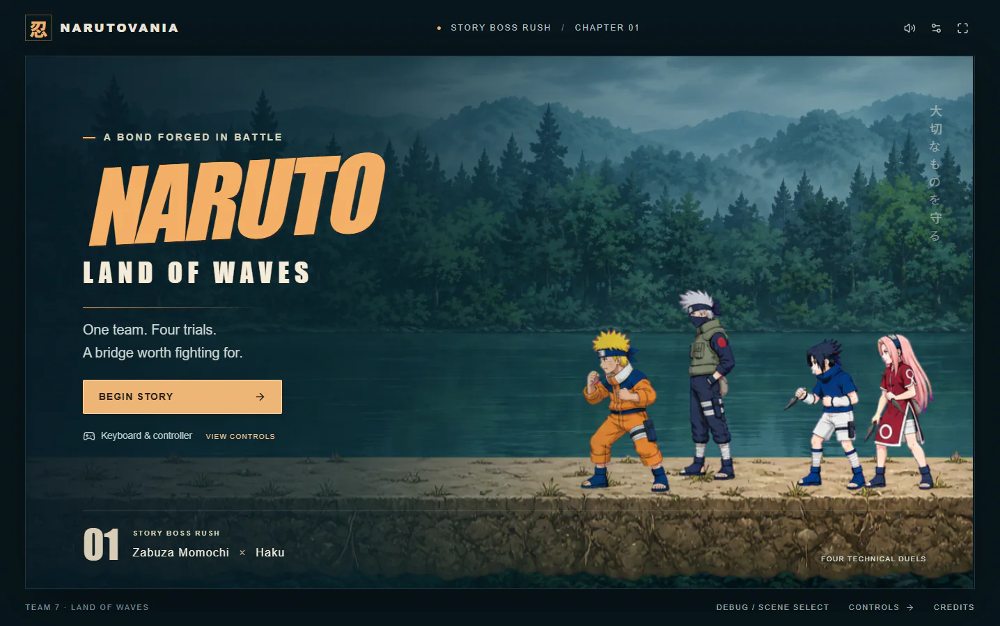
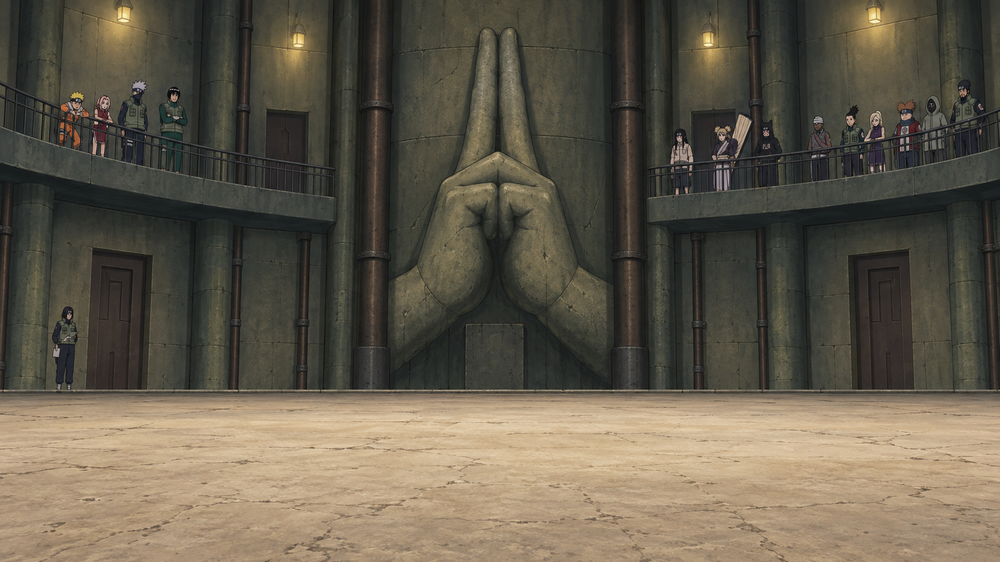
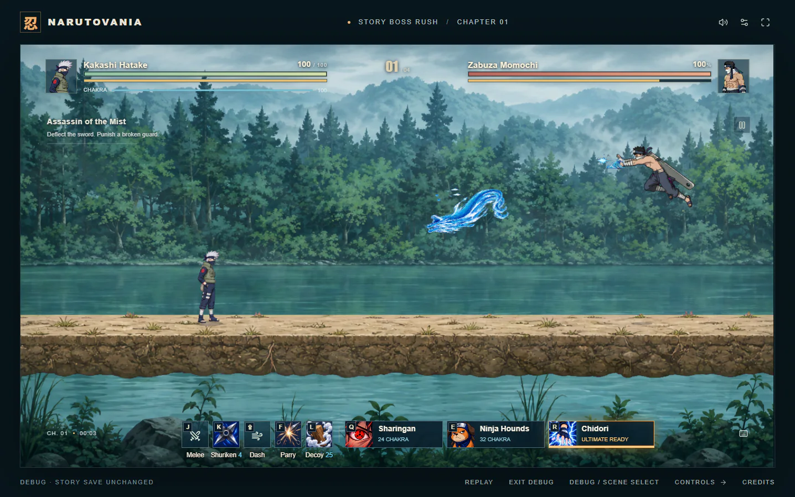
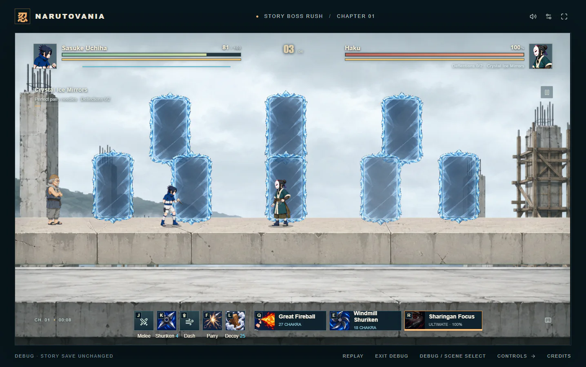
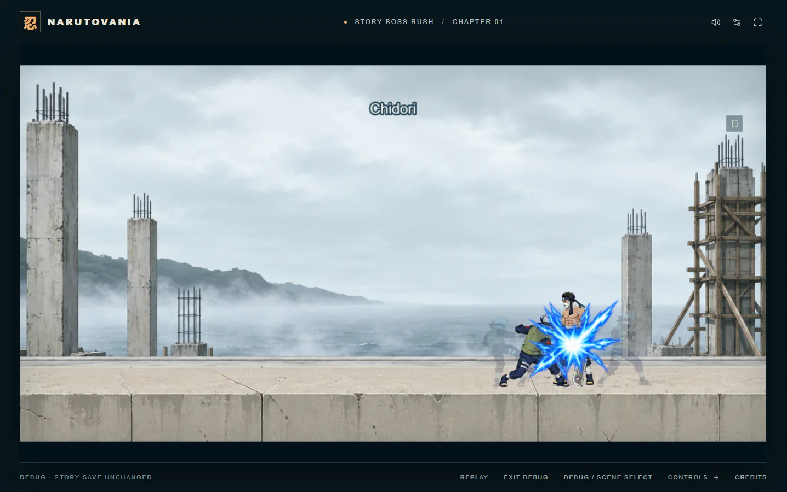

# Narutovania

<div align="center">

**A cinematic 2D Naruto boss rush built for the browser.**

[Play the game](https://narutovania.vercel.app/) · [Chapter workflow](docs/chapters/README.md) · [Audio credits](public/audio-v23/manifest.json)



</div>

## Chapter 2: The Power of Youth

Play Rock Lee against Gaara in the indoor Chunin Exam preliminary arena. One continuous health bar carries the duel through the Shield of Sand, Lee dropping his weights at 70%, and the Fifth Gate at 35%. Use stationary taijutsu combos, Hurricane kicks, Lotus Launcher, and cinematic Lotus techniques against shifting sand barrages and floor-bouncing projectiles.

A short animated introduction gathers the observing shinobi around the arena. Completing the duel preserves the manga outcome: Gaara wins, and Guy saves Lee. Retry resumes at the latest power-up with Gaara's saved remaining health. Chapter Select keeps Land of Waves available with separate saved progress.



Lee uses **stamina, not chakra**. K is a quick palm strike, L is a physical backstep, and Q/E are taijutsu techniques. All travelling sand projectiles can be perfect-parried, including ricochets. Watch Gaara's pale hand glint, time the bright projectile core, and dodge the outlined ground spells. Both chapters support double jump and airborne parry.

[Chapter 2 production guide](docs/chapters/chunin-exams/CHAPTER_SPEC.md)

## Relive Team 7's first major battle

Take control of Kakashi, Naruto, and Sasuke through four connected boss fights against Zabuza and Haku. The chapter recreates the Water Prison rescue, Haku's Crystal Ice Mirrors, Sasuke's sacrifice, Naruto's awakening, and Zabuza's final stand with animated in-engine story scenes.

The combat mixes stamina management, perfect parries, blocking, ground and air dashes, substitution, character techniques, and dramatic ultimates. Every fight starts with an ultimate ready, then rewards aggressive play and well-timed defenses with another charge.

| Zabuza's water barrage | Haku's Crystal Ice Mirrors |
| :---: | :---: |
|  |  |

## Play as Team 7

- **Kakashi Hatake** — Sharingan, Ninja Hounds, and a cinematic Chidori ultimate.
- **Naruto Uzumaki** — Shadow Clones, transformation feints, Clone Barrage, and awakened Nine-Tails techniques.
- **Sasuke Uchiha** — Great Fireball, Windmill Shuriken, and Sharingan Focus.
- **Sakura Haruno** — Protects Tazuna through the story, with her combat kit available in Scene Select.



## Four technical duels

1. **Assassin of the Mist** — Kakashi reads Zabuza's sword pressure and water techniques.
2. **Rescue Kakashi** — Naruto and Sasuke combine attacks against Zabuza's water clone.
3. **Crystal Ice Mirrors** — Sasuke survives coordinated senbon volleys and exposes the real Haku.
4. **The Broken Seal** — Awakened Naruto shatters the mirror formation and confronts Haku.

Perfect-parried mirror needles return to the real Haku. Deflect two separate volleys to force him from the mirrors, or create an opening through guard breaks and character techniques. Boss barrages keep a viable ground route while rewarding precise dashes and parries.

## Controls

| Action | Keyboard | Controller |
| --- | --- | --- |
| Move / crouch | A/D or arrows; S/down | Left stick / D-pad |
| Jump / double jump | Space; press again in the air | A / Cross; press again in the air |
| Melee / charged heavy | J / down + hold J | X / Square |
| Shuriken | K | Y / Triangle |
| Dash / air dash / slide | Shift; down modifies | B / Circle |
| Parry / block | Tap / hold F | Tap / hold LB / L1 |
| Techniques | Q and E | RB/R1 and RT/R2 |
| Substitution | L | LT / L2 |
| Ultimate | R | Right-stick click |
| Pause | Escape | Start / Options |

The public **Scene Select** jumps directly to fights, story transitions, and chapter-specific previews without changing normal saved progress. Chapter 2 also includes **Sound check** buttons for its new Audacity-edited combat cues.

## Creating future chapters

Copy this prompt into Codex while this project is open:

> **Make a new chapter about [manga moment/fight]. Follow the chapter workflow.**

The root [AGENTS.md](AGENTS.md) and [chapter production guide](docs/chapters/README.md) cover canon research, generated artwork, specialist delegation, combat implementation, independent game-development critique, regression testing, and release. Per-chapter templates preserve decisions and progress across restarts.

## Project skills and continuity

The [project handbook](docs/project/README.md) contains current status, decisions, known issues, the asset map, and the test map. Seven project-local skills cover chapter production, sprite consistency, combat tuning, scene continuity, audio, independent game QA, and releases. They live in `.agents/skills/` with this project.

For a focused task, try `Use $narutovania-sprite-audit to review Lee's attack proportions.` After a restart, use `Continue from docs/project/STATUS.md and verify the last completed milestone.` Ordinary language still works; [AGENTS.md](AGENTS.md) points the agent to the relevant instructions.

## Run locally

Requires Node.js 22.13 or newer.

```sh
npm ci
npm run dev
```

Open the local URL printed by the development server.

```sh
npm run typecheck
npm test
npm run lint
npm run build
```

The client-only production build is exported to `dist/client`. The game uses TypeScript, React, Phaser 3.90.0, and Vinext, with no database or account required.

## Assets, credits, and deployment

`public/` contains runtime artwork and licensed audio. `art/` retains generation prompts and audit notes, while `scripts/` contains repeatable preparation tools. Full audio attribution is available for [Chapter 1 and music](public/audio-v23/manifest.json) and [Chapter 2 effects](public/audio-chunin/manifest.json), and inside the game.

`vercel.json` builds the static export for Vercel. `.openai/hosting.json` retains the legacy Sites deployment configuration. Generated caches, recordings, screenshots, and build artifacts are excluded from Git; see the [latest cleanup report](docs/maintenance/2026-09-08-cleanup.md).

This is an unofficial fan project. Naruto and its characters belong to Masashi Kishimoto and their respective rights holders. It is not affiliated with or endorsed by the rights holders.
